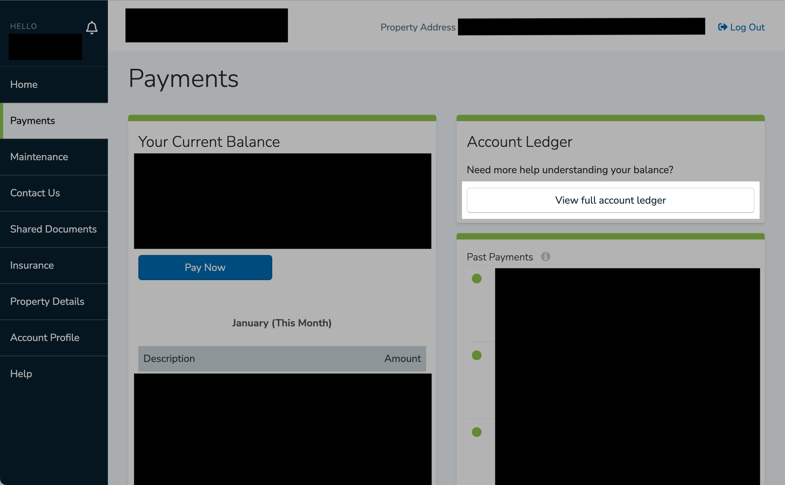
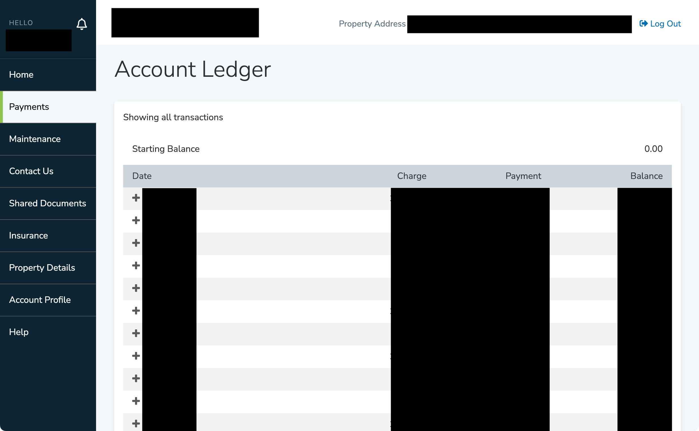

# Overview

[AppFolio](https://www.appfolio.com/) is a system that some landlords use to collect rent.

From the tenant's side, you can see your full account ledger (including your rent payment history).
But it doesn't copy-paste well, and there's no built-in way to export it to a file.

This script extracts the data from the HTML and converts it to CSV so it's easier to work with. Potentially handy if you need to prove a point to your landlord.


# Example output

```csv
date      , description                    , paid_by , charge    , payment
05/01/2020, Rent - May 2020                ,         , "1234.56",
05/01/2020, ACH Payment (Reference #ABC123), John Doe,           , "1234.56"
...
```


# Instructions

1. Install dependencies:
   1. Python 3.10
   2. [Beautiful Soup 4](https://pypi.org/project/beautifulsoup4/)
2. Log on to the [appfolio.com](https://www.appfolio.com/) portal where you pay rent.
3. On the **Payments** page, select **View full account ledger**:

   

   You should see a table with all your charges and payments:
   
   
4. Save the page's HTML to a file. In Chrome, you can do **File** > **Save Page As...** and choose **Format: Webpage, HTML Only**. Alternatively, you can right-click, select **View Page Source,** and copy-paste.
5. Run the script with the HTML file as input.
